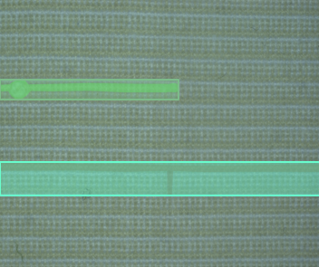
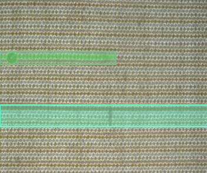

# OLP-dataset

This repository provides the OLP-dataset underlying our manuscript *Increasing the Generalization of Supervised Fabric Anomaly Detection Methods to Unseen Fabrics* published at Sensors in 2022 as well as accompanying code for data-loading.

## Dataset overview

OLP consists of 38 patterned fabrics.
Opposed to related, public fabric defect datasets, it consists of high-resolution image-pairs taken with both front-light and back-light illumination.
Such a multi-illumination setup was shown to improve performance at detecting defects, and is state-of-the-art in industry.
Furthermore, we provide instance-level defect classes, segmentations and bounding boxes.



For exhaustive details, we refer to the overview given in the manuscript.

## Getting the dataset

The dataset can be downloaded by executing:

```
wget https://www.lfb.rwth-aachen.de/download/olp-dataset.tar
tar -xvf olp-dataset.tar -C olp-dataset/
```
in a shell.
Alternatively, the URL can of course be opened in the browser to trigger the download that way.

## Dataset structure
We provide the images of every fabric in the corresponding `Texile_$ID` folder, and store all annotations in `Texile_$ID/dataset.json`.
Annotations are furthermore given in the popular [`ms-coco`](https://cocodataset.org/) format.

The design-philosophy is to then construct a dataset per fabric, and compose them via concatenation.
For examples, please look at the two notebooks provided in [`dataloading-code`](dataloading-code).

## Citation and contact

If you make use of the OLP-dataset, please consider citing our paper published at Sensors

```
@Article{s22134750,
AUTHOR = {Rippel, Oliver and Zwinge, Corinna and Merhof, Dorit},
TITLE = {Increasing the Generalization of Supervised Fabric Anomaly Detection Methods to Unseen Fabrics},
JOURNAL = {Sensors},
VOLUME = {22},
YEAR = {2022},
NUMBER = {13},
ARTICLE-NUMBER = {4750},
URL = {https://www.mdpi.com/1424-8220/22/13/4750},
ISSN = {1424-8220},
DOI = {10.3390/s22134750}
}
```

If you wish to contact us, you can do so at [`oliver.rippel@lfb.rwth-aachen.de`](mailto:oliver.rippel@lfb.rwth-aachen.de)


## License

Copyright (C) 2022 by RWTH Aachen University                      
http://www.rwth-aachen.de                                             
                                                                         
License:                                                                                                                                       
This software is dual-licensed under:                                 
• Commercial license (please contact: lfb@lfb.rwth-aachen.de)         
• AGPL (GNU Affero General Public License) open source license 

The dataset itself is furthermore licensed under [CC-BY-ND-SA-4.0](https://creativecommons.org/licenses/by-nc-sa/4.0/).